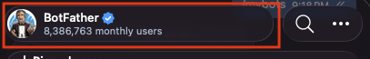
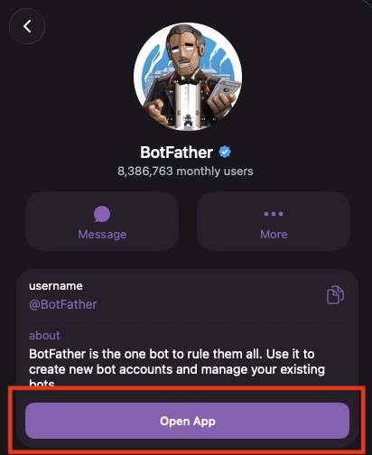
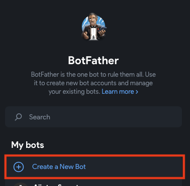
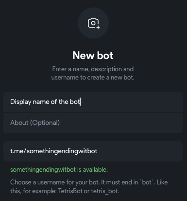
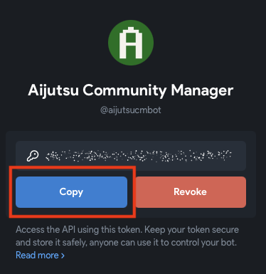

# Create your Telegram bot

A bot is an automatic Telegram account. Your agent uses it to chat with you. You make bots with BotFather, Telegram's official bot for making bots.

In Telegram, search for `@BotFather` and open it. Check that it has a blue tick. Tap **Start**.

## Create the bot account

There are two ways to do this, and both give you the same thing: a bot, and a token for it. The mini app is a small app inside Telegram, with buttons to tap. The chat way is a conversation: you send BotFather commands, and it asks you questions.

Pick one. Click its name to open it.

In the BotFather mini app

1. Tap BotFather's name at the top of the chat, to open its profile.

   

2. Tap **Open App**.

   

3. Tap **Create a New Bot**.

   

4. Fill in the details for your bot:

   - **Display name of the bot**: the name people see, for example `Heartlands Helper`.
   - **About**: you can leave this empty.
   - **Username**: it must end in `bot`, for example `heartlands_helper_bot`. It can only use letters, numbers and underscores (`_`). You can't change it later. A message under the box tells you whether the username is free.

   

5. Your bot is made, and its page shows the token. The token is hidden behind a sparkle. Don't tap the sparkle: tap **Copy** instead, and paste the token somewhere safe like a password manager. It should look like `123456789:AAHdqTcvCH1vGWJxfSeofSAs0K5PALDsaw`

   

In the chat with BotFather

1. In the chat with BotFather, send `/newbot`.
2. BotFather asks for a name. This is the name people see, for example `Heartlands Helper`.
3. BotFather asks for a username. It must end in `bot`, for example `heartlands_helper_bot`. It can only use letters, numbers and underscores (`_`). You can't change it later.
4. BotFather replies with a token, like `123456789:AAHdqTcvCH1vGWJxfSeofSAs0K5PALDsaw`. Copy it and keep it somewhere safe like a password manager.

## Keep the token safe

The token is your bot's password: anyone who has it can control your bot. Don't share it, and don't put it in a message or a photo. You need it later, in [Run NanoClaw's setup](../03-run-setup/index.md).

## Let your bot read group messages

Your bot starts with Group Privacy on. With it on, the bot only sees messages that mention it. Turn it off, so your agent can follow a whole group chat.

1. Open your bot's page in BotFather and scroll down to **Bot Settings**.

   

2. Tap **Bot Settings** and turn off **Group Privacy**.

   

You can also do this in the chat with BotFather: send `/mybots`, pick your bot, then tap **Bot Settings**, **Group Privacy**, and **Turn off**.

If your bot is already in a group, remove it from the group and add it again. The change only works after that.

## Next

Your bot is ready, and you have its token. Next, [download NanoClaw](../02-download-nanoclaw/index.md).
