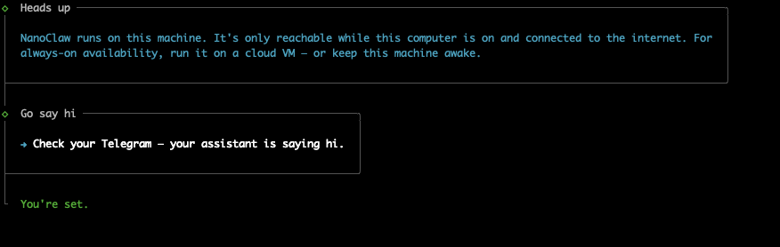
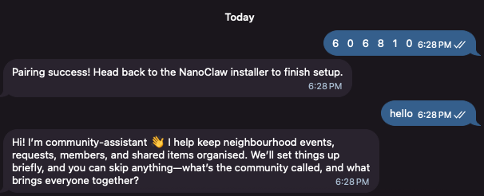

# Run NanoClaw's setup

NanoClaw comes with a setup program. It installs the rest of what NanoClaw needs, builds your agent, and connects it to Telegram. You answer its questions as it runs.

Your agent runs on Codex. You run setup yourself, in the terminal. If it stops with an error, it offers to open Codex — or [Claude Code](../../../glossary.md#claude-code), if you installed it — to help you fix it.

## Before you run setup

- **On a Mac:** make sure OrbStack or Docker Desktop is running.
- **On Windows:** make sure Docker Desktop is running.
- **On Windows or Linux:** run `sudo -v` in your [terminal](../../01-installations/01-terminal/index.md) and type your password. Setup installs some programs, and this lets it do that without stopping to ask.

Have the bot token from [Create your Telegram bot](../01-telegram-bot/index.md) ready. Setup asks for it.

## Run it

In your terminal, in the `nanoclaw` folder, run:

```bash
bash nanoclaw.sh --agent-provider codex
```

`--agent-provider codex` tells setup to run your agent on Codex. Without it, setup uses Claude.

Setup installs the rest of what NanoClaw needs, and builds your agent's container. The first build usually takes 3 to 10 minutes. **If you run into any issues, check the section just below this.**

Use the arrow keys to pick an answer, then press Enter. Answer the questions like this:

| Setup asks | Your answer |
| --- | --- |
| How would you like to begin? | **Standard setup** |
| How should we create your first agent? | **From local templates** |
| Choose a template | **`community-assistant`** |
| How would you like to connect Codex? | **Sign in with my ChatGPT subscription**. Sign in in the browser, then go back to the terminal. On Windows, if no browser opens, copy the link into your browser. |
| What should your assistant call you? | `<enter your name>` |
| (Your assistant is ready.) What next? | **Continue with setup** |
| I detected … from your computer settings. Is that right? | **Yes**, if it shows your time zone |
| Want to chat with your assistant from your phone? | **Yes, connect Telegram** |
| Connect Telegram? | **Yes, connect Telegram** |
| How should this telegram account be registered? | **Owner** |
| Paste the bot token from BotFather (looks like `123456:ABC-DEF...`). | The token from the first page. It will appear as "▪▪▪▪..." while you paste. That is normal. |
| Open `https://telegram.me/<your bot name>` in your browser? | Yes (if prompted in your browser, click **Open Telegram.app** before the next step), when the chat with `<your bot name>` opens, click on **Start** |
| Ready? The next step starts immediately. | Yes |
| Your pairing code is ready (followed by 6 numbers) | In the open Telegram chat with `<your bot name>`, send the 6 digits. You should see the bot respond with **"Pairing success! Head back to the NanoClaw installer to finish setup."** |

If setup asks something that isn't in this table, such as an offer of a free NanoClaw account, always skip it.

When setup is done, it says **You're set.**:



It will take 30s to 1 minute for the first message to come through. Your agent introduces himself — he is called **Louis** — and asks you to connect Notion, which is where he keeps everything. That is the next lesson, so you can leave it for now. The message looks something like this:



## Say hi to your agent

Reply to it. Your agent answers in two places:

- **In your private chat with the bot**, it answers every message.
- **In a group**, mention the bot by its username, for example `@heartlands_helper_bot`, so that it knows the message is for it.

### When your agent is awake

NanoClaw runs in the background, on your own computer. Your agent only answers while your computer is on and Docker is running.

If your agent stops answering, check that Docker is running, and that you have not moved or renamed the `nanoclaw` folder.

## Common issues

| Issue | You answer |
| --- | --- |
|  Found an existing OneCLI at http://127.0.0.1:10254. What would you like to do? | Install a fresh instance for NanoClaw |
| Couldn't clean up the test agent — it may still appear in your agent list. See logs/setup-steps/08-cleanup-cli-agent.log for details. | Continue with setup |

If setup stops with an error, it offers to open Codex, or Claude Code, to help you fix it. You can also run `bash nanoclaw.sh --agent-provider codex` again: it continues from where it stopped. Setup keeps a record of every step in `logs/setup.log`.

## Next steps

Your agent is running, and it can chat. It has nowhere to keep what it learns yet, so next, give it one: [Setting up data sources](../../03-setting-up-data-sources/index.md).

When you no longer want NanoClaw on your computer, the [Cleaning Up](../../04-cleaning-up/index.md) lesson removes it.
