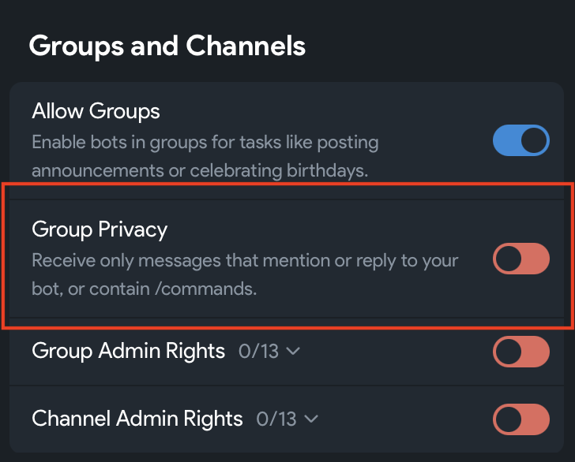

# Setting up NanoClaw

In this lesson, you install NanoClaw and connect it to Telegram. At the end, you have your own AI agent, and you can chat with it on Telegram.

Before you start, finish the [Installations](../01-installations/index.md) lesson. You need Git, Docker and Codex.

## Important notes

1. This course uses our own copy of NanoClaw. It is a [fork](../../glossary.md#fork): a copy of a project that you can change without changing the original. We changed it with NanoClaw's own skills, so that it works with Telegram and Codex. Our version of Nanoclaw can be found at the [aith-nanoclaw-codex-telegram](https://github.com/aijutsu/aith-nanoclaw-codex-telegram) project on GitHub and can be used independently of this course

## Setup steps

### Step 1: Create your Telegram bot

A bot is an automatic Telegram account. Your agent uses it to chat with you. You make bots with BotFather, Telegram's official bot for making bots.

1. In Telegram, search for `@BotFather` and open it. Check that it has a blue tick. Tap **Start**.
2. Send `/newbot`.
3. BotFather asks for a name. This is the name people see, for example `Heartlands Helper`.
4. BotFather asks for a username. It must end in `bot`, for example `heartlands_helper_bot`. It can only use letters, numbers and underscores (`_`). You can't change it later.
5. BotFather replies with a token, like `123456789:AAHdqTcvCH1vGWJxfSeofSAs0K5PALDsaw`. The token is your bot's password: anyone who has it can control your bot. Don't share it. You need it in Step 3.

To use your bot in group chats, turn off its Group Privacy setting. With Group Privacy on, the bot only sees messages that mention it.

1. After the bot is created, open its page in BotFather and scroll down to **Bot Settings**.

   

2. Tap **Bot Settings** and turn off **Group Privacy**.

   

You can also do this in the chat with BotFather: send `/mybots`, pick your bot, then tap **Bot Settings**, **Group Privacy**, and **Turn off**.

If your bot is already in a group, remove it from the group and add it again. The change only works after that.

### Step 2: Download NanoClaw

Run these three commands:

```bash
cd ~
git clone https://github.com/aijutsu/aith-nanoclaw-codex-telegram.git nanoclaw
cd nanoclaw
```

- `cd ~` goes to your home folder. On Windows, this keeps NanoClaw inside Ubuntu, where it runs faster than on your C: drive.
- `git clone` downloads our copy of NanoClaw into a new folder called `nanoclaw`. You see `Cloning into 'nanoclaw'...`.
- `cd nanoclaw` moves you into that folder.

Don't move or rename the `nanoclaw` folder after setup. NanoClaw names its background service after the folder, and moving it breaks the link.

### Step 3: Set up NanoClaw

Your agent runs on Codex. For setup itself, you can use Codex or [Claude Code](../../glossary.md#claude-code) as your helper. The helper shows you NanoClaw's setup skill, and helps you fix things if setup stops with an error. Open the one you use.

NanoClaw comes with [skills](../../glossary.md#skills): instructions that Codex and Claude Code can read. First, see one of them in action.

<details name="setup-helper">
<summary>Codex</summary>

You installed Codex in the [Installations](../01-installations/index.md#step-4-install-codex) lesson.

1. In the `nanoclaw` folder, start Codex:

   ```bash
   codex
   ```

   If Codex asks whether you trust this folder, say yes.
2. Type `$setup` and press Enter. Codex reads NanoClaw's setup skill. It tells you to run `bash nanoclaw.sh`.
3. Type `/quit` and press Enter to leave Codex. Setup asks you questions as it runs, so you run it yourself, in the terminal.

If setup stops with an error:

- **After setup has connected Codex,** it asks **Want to debug this with Codex?** Choose **Yes**. Codex opens. It already knows what went wrong, and helps you fix it. Type `/quit` to go back to setup.
- **Before that,** it asks **Claude CLI is needed to diagnose this. Install it now?** Claude needs a Claude plan. If you don't have one, choose **No**. Then start Codex in the `nanoclaw` folder and ask it: "Setup failed. Read logs/setup.log and help me fix it."

</details>

<details name="setup-helper">
<summary>Claude Code</summary>

Claude Code needs a Claude plan: Pro or higher. The free plan doesn't include it. Your agent still runs on Codex, so you also need Codex (from the [Installations](../01-installations/index.md#step-4-install-codex) lesson) and your ChatGPT plan.

1. Install Claude Code:

   ```bash
   curl -fsSL https://claude.ai/install.sh | bash
   ```

2. Check that it works:

   ```bash
   claude --version
   ```

   You should see a version number, like `2.1.211 (Claude Code)`. If you see `command not found`, close the terminal, open a new one, and try again.
3. In the `nanoclaw` folder, start Claude Code:

   ```bash
   cd ~/nanoclaw
   claude
   ```

   The first time, your browser opens. Sign in to your Claude account, then go back to the terminal. If Claude Code asks whether you trust this folder, say yes.
4. Type `/setup` and press Enter. Claude Code reads NanoClaw's setup skill. It tells you to run `bash nanoclaw.sh`.
5. Type `/exit` and press Enter to leave Claude Code. Setup asks you questions as it runs, so you run it yourself, in the terminal.

If setup stops with an error:

- **Before setup has connected Codex,** it asks **Want to debug this with Claude?** Choose **Yes**. Claude Code opens. It already knows what went wrong, and helps you fix it. Type `/exit` to go back to setup.
- **After that,** it offers Codex first: **Want to debug this with Codex?** Choose **Yes** to use Codex, and type `/quit` to go back to setup.

</details>

Before you run setup:

- **On a Mac:** make sure OrbStack or Docker Desktop is running.
- **On Windows:** make sure Docker Desktop is running.
- **On Windows or Linux:** run `sudo -v` and type your password. Setup installs some programs, and this lets it do that without stopping to ask.

Now run setup:

```bash
bash nanoclaw.sh --agent-provider codex
```

`--agent-provider codex` tells setup to run your agent on Codex. Without it, setup uses Claude.

Setup installs the rest of what NanoClaw needs, and builds your agent's container. The first build usually takes 3 to 10 minutes. Use the arrow keys to pick an answer, then press Enter. Answer the questions like this:

| Setup asks | Your answer |
| --- | --- |
| How would you like to begin? | **Standard setup** |
| How should we create your first agent? | **Fresh agent** |
| How would you like to connect Codex? | **Sign in with my ChatGPT subscription**. Sign in in the browser, then go back to the terminal. On Windows, if no browser opens, copy the link into your browser. |
| What should your assistant call you? | Your name |
| What next? | **Continue with setup** |
| I detected … from your computer settings. Is that right? | **Yes**, if it shows your time zone |
| Want to chat with your assistant from your phone? | **Yes, connect Telegram** |
| Connect Telegram? | **Yes, connect Telegram** |
| What should your assistant be called? | A name for your agent. The default is `Nano`. |
| How should this telegram account be registered? | **Owner** |
| Paste the bot token from BotFather | The token from Step 1. It stays hidden while you paste. That is normal. |
| Your pairing code is ready | Open your bot in Telegram and send it the 6 digits, as a private message. |

If setup asks something that isn't in this table, such as an offer of a free NanoClaw account, you can skip it.

When setup is done, it says **You're set.**

If setup stops with an error, it offers your helper, as described above. You can also run `bash nanoclaw.sh --agent-provider codex` again: it continues from where it stopped. Setup keeps a record of every step in `logs/setup.log`.

### Step 4: Say hi to your agent

Open Telegram. Your agent has sent you a message in your chat with your bot. Reply to it.

- In your private chat with the bot, your agent answers every message.
- In a group, mention the bot by its username, for example `@heartlands_helper_bot`, so that your agent answers.

NanoClaw runs in the background. Your agent only answers while your computer is on and Docker is running.
