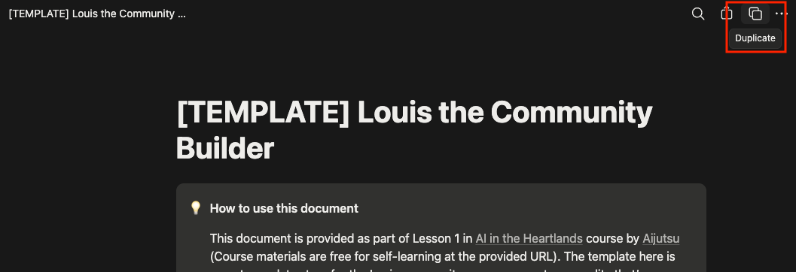
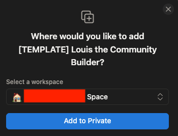
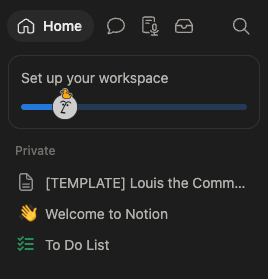

# Create the Notion page

Your agent is known as **Louis**, and Notion is where he keeps everything: who is in your community, what is going on, if anyone has borrowed anything/lending anything.

Like any AI agent, Louis requires a **data store**. This could be a proper database management system, but for this introduction to agents, we can use Notion which provides databases as tables and also allows us to easily edit the page where required.

A template you can copy into your own [Notion](../../../glossary.md#notion) workspace has been created for you for the purpose of facilitating more critical learning points like how to connect data stores.

## Make your own copy of the template

1. Open the template that's publicly available at [this link](https://interesting-cheek-b88.notion.site/TEMPLATE-Louis-the-Community-Builder-3e4f2896ef0c80988978ee9724337b93?pvs=74)

    On the top right, identify the **Duplicate** icon and click on it

    

2. Sign in to Notion and go through the onboarding process if it asks you to.
3. You will be asked where you would like to add `[TEMPLATE] Louis the Community Builder`, if you just signed up with Notion, the default is fine, otherwise, choose a workspace which you are fine with AI agents using.

    

    After selecting the workspace, click on **Add to Private**

    Wait for ~10-20 seconds and you should see the page appear in your side navigation menu:

    

From here on, this copy is yours: Louis writes to it, and nobody else's copy is touched. If you belong to more than one workspace, check it landed in the one you meant — moving it later is awkward.

## What you just copied

This page contains sixteen mini [databases](../../../glossary.md#database) inside it. You don't have to read or understand them all right now, Louis already knows what each one is for based on Skills that we have prepared, but if you're interested, a summary is:

| These hold | Databases |
| --- | --- |
| Who is in the community | Members, Telegram Accounts, Discord Accounts |
| Where they live | Blocks |
| What's happening | News, Events |
| Things people share | Items for Loan, Loans |
| Neighbours helping neighbours | Help Requests, Introductions, Lost and Found |
| The neighbourhood itself | Neighbourhood Directory, Community Cats, Cat Sightings, Estate Issues |
| What Louis did, and why | Admin Log |

They are empty, and that is normal. They fill up as you and whoever you invite talks to Louis.

> [!NOTE]
> The template is built with a Singapore HDB estate in mind, so it talks about blocks, Town Councils, HDB and NEA. It works anywhere: a "block" can be a building, a street, or a cluster of houses, and you can rename the reporting options to suit your own geolocation if you're accessing this course outside of Singapore.
> 
> This mainly serves as an example of the data being able to shape the behaviour of the agent we create; it'd be useful to also think about other use-cases in your life such as *"What would a database structure that suits my office look like?"* or *"Could I use a similar setup to help me organise different aspects of my work/life?"*

## Verify that it worked

At this point, you should have:

1. A page in **your** workspace, in the sidebar on the left; and
2. Sixteen empty Notion tables (read: databases) inside it.

> [!WARNING]
> Keep working in **your copy**, not the template you copied it from. They look identical, and Louis will ask you for the link to your copy on the last page of this lesson. If you send the link to the original by mistake, Louis will tell you that they're unable to find it or write to it.

## Next

Now make the connection that lets Louis in: [Create a Notion connection](../02-notion-connection/index.md).
