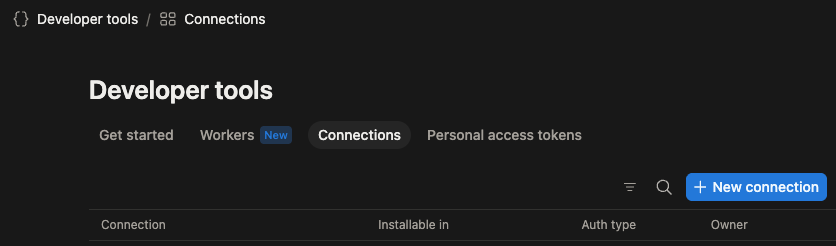
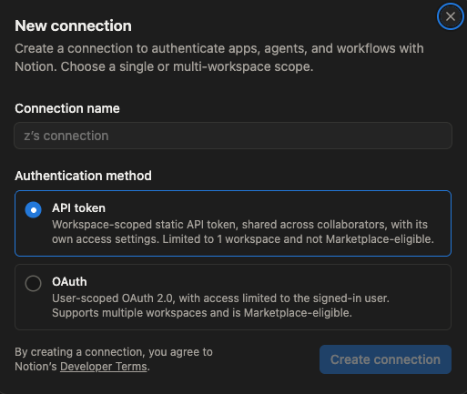
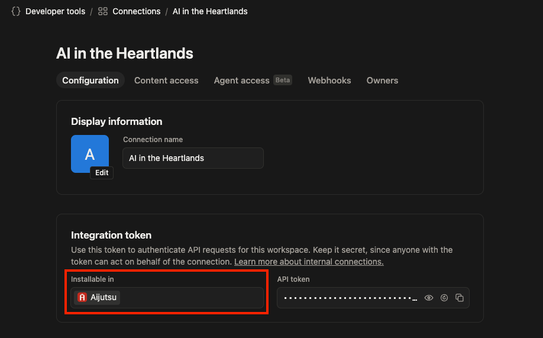
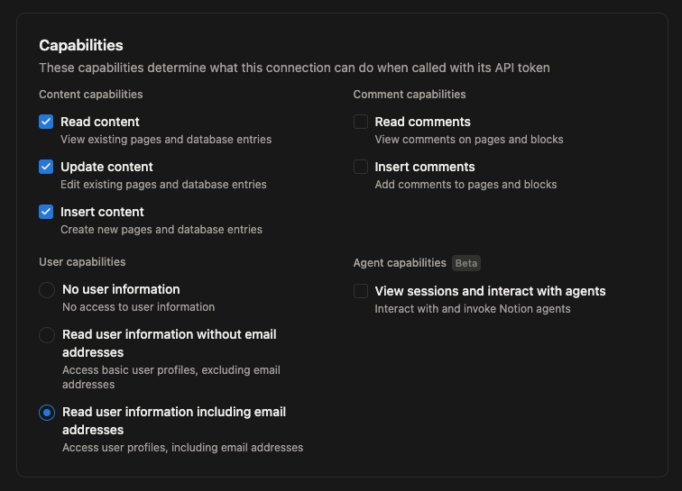
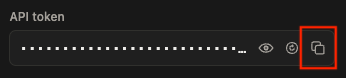
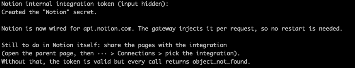
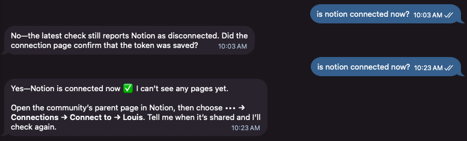

# Create the Notion Connection

A **Connection** is how a program signs in to Notion. It is not a person and it has no password: it uses what's known as a [token](../../../glossary.md#token), a long series of random alphabets/numbers/symbols that can be used in place of a username and password.

A Connection starts with access to **nothing at all**, even when its token is perfect. You give it access to your page yourself, in the second half of this page. That is the step most people miss.

## Setting up the Connection

Note that you must be the owner of the workspace to do this (this means you probably won't be able to do this in your company unless you're the administrator of Notion)

1. Go to <https://app.notion.com/developers/connections>. This is Notion's developer portal. Sign in if it asks you to and **note your Workspace name**.

    You should see this header:

    

2. Click on **New connection**.

    You should see a dialog pop up:

    

    1. Give a name you would recognise later in the **Connection name**, select **API token**, and click on **Create connection**

        

    2. Check that the **Installable in** field indicates **your Workspace name** (from step 1)
    3. The API token allows anyone access to your data, keep it away from others. We will use this token to allow our bot to access data

3. Observe the **Capabilities** section, this is where we can assign user permissions.
   
   

   1. Set the **User capabilities** to **No User information** if you'd like
   
4. Copy the **API token** by clicking the copy icon

    

    > [!WARNING]
    > The token is a password for your Notion workspace. Anyone who has it can read and change everything the connection can reach. Don't put it in a chat message, a photo, or an email. You need it in the next step, so keep it somewhere safe until then.

5. Go to your terminal where NanoClaw lives and use the command:

    ```sh
    make add-notion-connection
    ```

6. You should be prompted to enter in your Notion connection API token, paste from your clipboard into the field
7. You should see

    

8. You can also ask your bot if Notion is connected and it should now respond with a yes, although it can't see any pages:

    

## Give the Notion Connection access to your page

Your connection still can't see anything. Give it the copy of the Louis template you made on the [last page](../01-notion-page/index.md), and all sixteen databases under it come with it.

Do it in **either** place. Click the one you prefer.

<details name="page-access">
<summary>In Notion, on the page itself</summary>

1. Open your copy of the Louis template in Notion.
2. Click the **•••** menu in the top right corner of the page.
3. Click **Connections**, then **+ Add connection**.
4. Search for the name you gave your connection, and click it.
5. Confirm. Notion tells you the connection can reach this page and everything inside it.

</details>

<details name="page-access">
<summary>In the developer portal</summary>

1. Go back to <https://app.notion.com/developers/connections> and open your connection.
2. Click the **Content access** tab.
3. Click **Edit access**, then pick your copy of the Louis template.

</details>

## Check that it worked

Open your copy of the Louis template in Notion, click **•••**, and click **Connections**. Your connection's name is listed there.

If it isn't, your agent will be able to sign in but will find nothing, which is confusing later. It is worth checking now.

## Next

Your connection exists, NanoClaw has its token, and it can see your copy. Now introduce the two: [Point Louis at your copy](../03-watch-it-fill/index.md).
