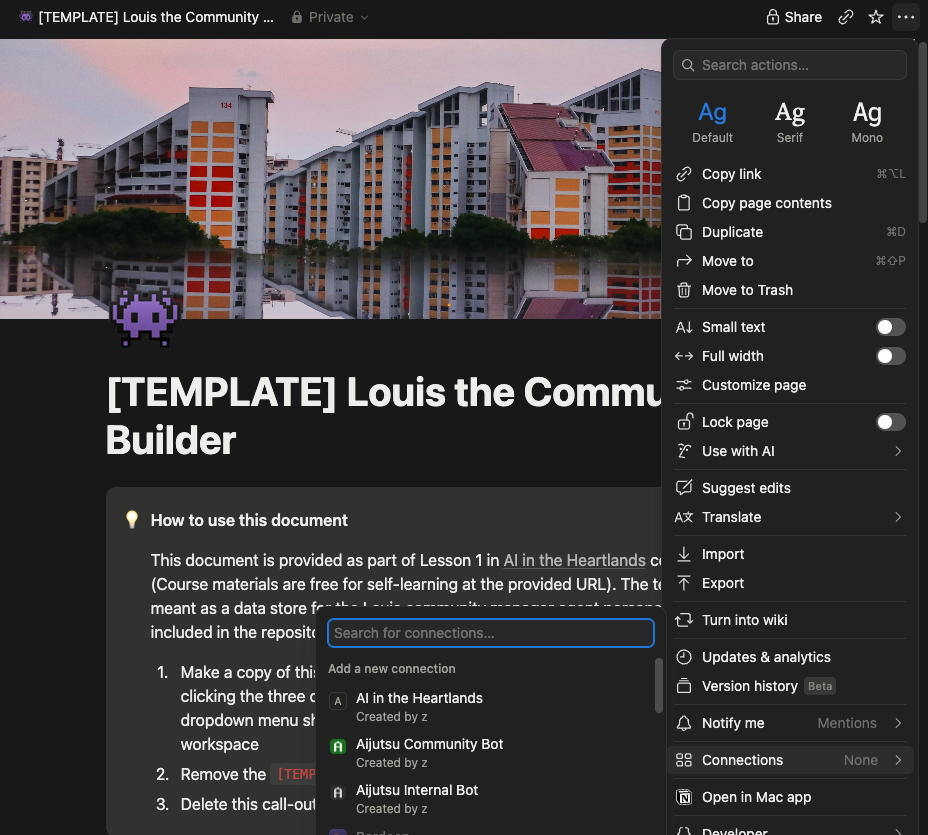
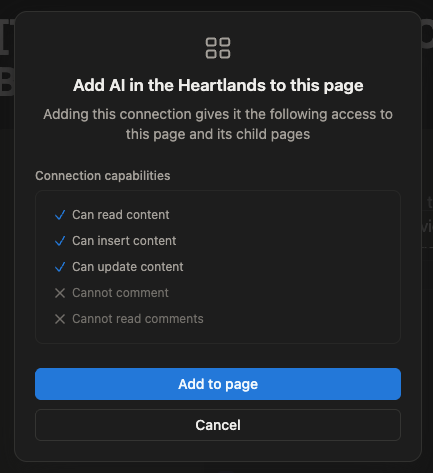
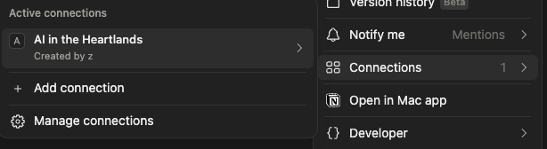
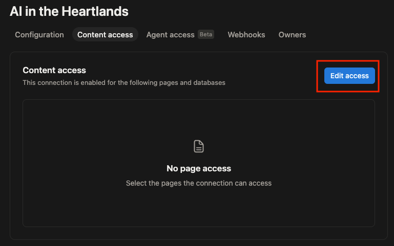
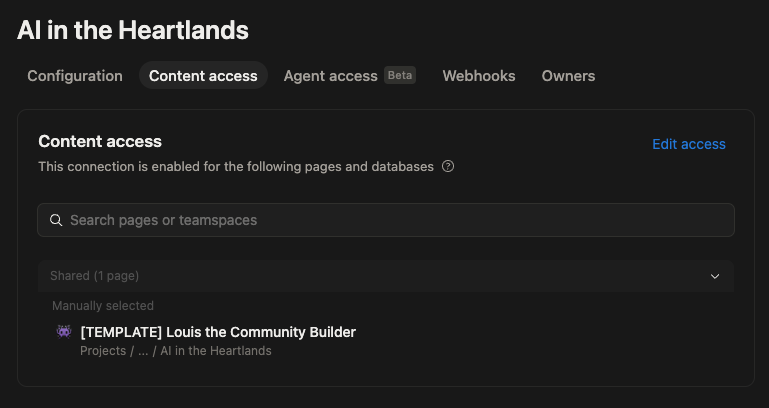

# Connect your Notion page

Your connection can sign in to Notion, but it still can't see anything. A new connection starts with access to **nothing at all**, even with a perfect token. You give it your page yourself, and that is this page.

This is the step most people miss. Skip it and everything looks fine until your agent tries to read something, and says it can't find a page you are looking straight at.

## Give it your page

Give it the copy of the Louis template you made on the [first page](../01-notion-page/index.md#copy-it), and all sixteen databases under it come with it. Notion passes access down, so this is one action, not sixteen.

Do it in **either** place. Click the one you prefer.

In Notion, on the page itself

1. Open your copy of the [Louis template](../01-notion-page/index.md#copy-it) in Notion.
2. Click the **•••** menu in the top right corner of the page.

    

3. Click **Connections**, then select the Connection you created

    

    Note that the permissions listed there are the permissions you gave your Connection when you first created it. In paid organisational Notions, these can be adjusted to be fine-grained

4. Click on **Add to page**

    You should now see that the Connection now has access to the page:

    

In the developer portal

1. Go back to [the Developer Connection portal on Notion](https://app.notion.com/developers/connections) and click on your newly created Connection.
2. Click the **Content access** tab.

    

3. Click **Edit access**, then pick your copy of the [Louis template](../01-notion-page/index.md#copy-it).

4. Observe that the page now appears in the **Content access** page

    

## Check that it worked

Open your copy of the Louis template in Notion, click **•••**, and click **Connections**. Your connection's name is listed there.

If it isn't, your agent will be able to sign in but will find nothing, which is confusing later. It is worth checking now.

## Next

Your connection can now read and write your page. Time to introduce it to your agent: [Connect your agent to Notion](../04-watch-it-fill/index.md).
