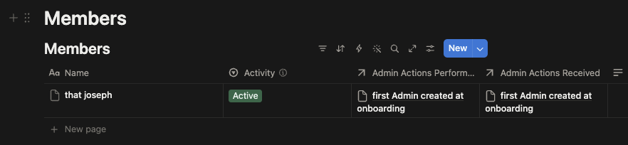
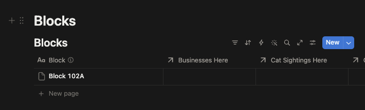
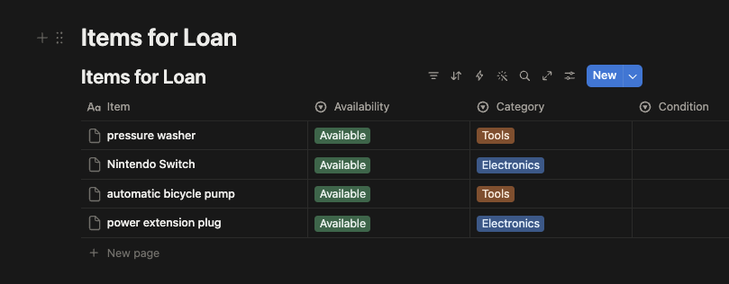

# Connect your agent to Notion

Louis can reach [Notion](../../../glossary.md#notion) now, but they don't know which page is yours. A workspace can hold several copies of the template, all with the same name, so they never go looking for it: they use the link you give them, and remember it.

This is the last step. After it, Louis works.

## Give Louis the link

1. Open your copy of the Louis template in Notion.
2. Copy its link: click **Share** at the top right, then **Copy link**. You can also copy the web address from your browser.
3. In your [Telegram](../../../glossary.md#telegram) chat with the bot, send the link, and say it is your copy. For example:

   ```
   Here's our community page: <paste the link>
   ```

>[!WARNING]
> The first message to initialise the community page takes awhile (30s-1 minute). Even if your bot stops showing *Typing...*, it's likely still working in the background.

Louis opens it and checks it over. They confirm that all sixteen [databases](../../../glossary.md#database) are there, and that they point at each other inside your copy rather than back at the original. Then they remember the page, and don't ask again.

If something is wrong with the copy, they say which database is missing and stop. Copy the template again, from [the last page but one](../01-notion-page/index.md), and send them the new link.

## Answer a few questions

Louis now asks you a short set of questions, one message at a time: what your community is called, where it is, which group chats they should post into, and when you want their daily and weekly summaries. Answer in your own words. You can skip anything.

When they ask what your community is called, tell them what it is and what their job is too. For example:

```text wrap
This is Bidadari RN, the residents' network for Bidadari estate. Your job is to help other residents in the group, based on the database you have access to.
```

You become the community's first **admin**, so Louis adds you to the Members database as they go. You can verify this by opening up Notion and seeing that you've been added to the list of members along with your Telegram user details:



>[!NOTE]
> When you're talking to Louis 1-1, Louis responds to every message. This happens only in 1-1 direct messages, later on in a group setting, you will need to tag Louis or respond to Louis's messages before Louis responds.

## Put something in it

Tell Louis something worth keeping. For example:

```text wrap
I stay at Block 102A and I can lend a power extension plug, an automatic bicycle pump, a Nintendo Switch, and also a pressure washer.
```

Then open your copy in Notion and look at **Blocks**, your block should now be listed there:



Also check **Items for Loan** which should now contain the items you indicated you're open to lending:



That loop — you say it in chat, Louis writes it into Notion — is the whole point of a [data source](../../../glossary.md#data-source). From here you can tell them about an event, ask who is coming, report a broken lift, or ask what the neighbours have lent out.

## If something doesn't work

Louis explains problems in plain words, but they may quote one of these:

| What Louis says | What it means | What to do |
| --- | --- | --- |
| `401`, `unauthorized`, or "[API](../../../glossary.md#api) [token](../../../glossary.md#token) is invalid" | [NanoClaw](../../../glossary.md#nanoclaw) doesn't have your token, or it is the wrong one. | Run `make add-notion-connection` again, from [Create a Notion connection](../02-notion-connection/index.md). |
| `object_not_found`, on a page you can see | The token is fine. The connection has no access to your copy. | Give it access: [Connect your Notion page](../03-connect-notion-page/index.md). |
| `restricted_resource` | The connection can read, but not write. | On the connection's **Capabilities**, turn on updating and inserting content. |
| A database is missing | The copy didn't come through whole. | Copy the template again and send Louis the new link. |
| The rows look like somebody else's community | Louis is pointed at the original template, or another copy. | Send them the link to your own copy, and check the **Share** menu says your workspace. |

If Louis doesn't answer at all, it isn't a Notion problem: check that your computer is on and [Docker](../../../glossary.md#docker) is running (P.S. this is another reason you should come to our workshops :D)

## Next

We've now shown that Louis has a memory that you can also read in Notion. Now lets put them in front of people: [Customising your agent](../../04-agent-customisations/index.md).
