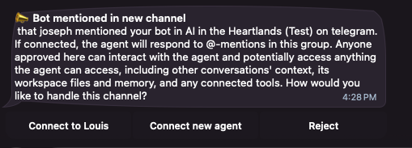
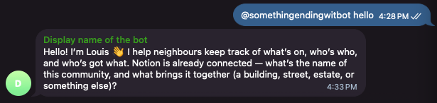
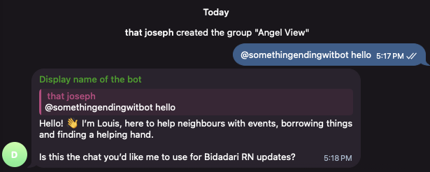
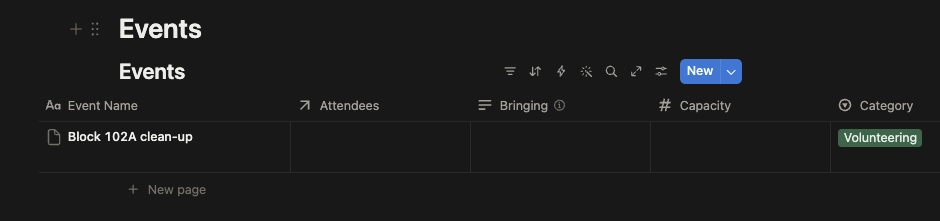
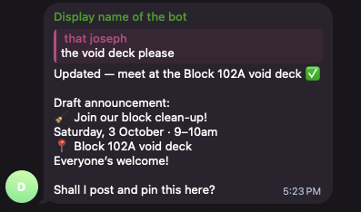

# Add your agent to the group

Putting the bot in the group was only half of it. In [NanoClaw](../../../glossary.md#nanoclaw), the **bot** is the phone line and the **agent** is who picks it up. Your group has a line but nobody on it, so a message there gets no answer.

Connecting them takes one message and one tap.

## Wake it up

In the group, mention the bot by its username and say anything:

```
@...bot hello
```

Use your own bot's username. The mention matters: NanoClaw ignores ordinary chatter in a room it hasn't been introduced to, so a plain "hello" does nothing.

Nothing happens in the group. That is expected.

## Say yes in your private chat

Open your **private** chat with the bot — the one you have been using all along. NanoClaw would have sent you a card that looks like:



It tells you which group it was (`AI in the Heartlands (Test)` in the example image), and who mentioned it (`that joseph` in the example image). Under that are your choices:

| Choice | What it does |
| --- | --- |
| **Connect to Louis** | Puts Louis on that group. **This is the one you want to choose.** |
| **Connect new agent** | Makes a **brand new, empty** agent for the group. For the purposes of this course, do not choose this otherwise it won't be Louis and your agent won't know about it's community management repsonsibilities or your [Notion](../../../glossary.md#notion) page. |
| **Reject** | Ignores that group from now on. Maybe don't click this either |

Tap **Connect to Louis**.

> [!NOTE]
> If you have more than one agent, the card says **Choose existing agent** instead, and asks which. If you only have Louis, you get their name on the button.

You should now see a message:

```
✅ Connected to Louis by <your username>
```

Louis now knows to answer in that group. They reply when someone mentions them, or replies to one of their messages. The rest of the time, the group can talk normally without them joining in. Their answers quote the message they are answering, so in a busy group you can see which question each answer is for.

You should also see Louis introducing themselves:



Alternatively, they might also be asking if this is the group to post updates in:



Say yes if so!

## Give Louis something to do

Everything below happens in the group chat.

>[!NOTE]
> When Louis answers you, [Telegram](../../../glossary.md#telegram) starts your reply to them by itself, so you can just type your next message to carry on the conversation. To reply to an older message of theirs, press and hold it (or right-click it on a computer), then choose **Reply**.

**Ask Louis something they have to look up:**

```text wrap
@...bot what's on this week?
```

Louis reads the **Events** [database](../../../glossary.md#database) in your Notion page and answers from it. With nothing in there yet, they say so plainly rather than inventing an answer.

**Tell them something they have to write down:**

```text wrap
@...bot we're doing a block clean-up at 102A this Saturday from 9am to 10am, everyone is invited
```

Louis writes it into **Events**. Open your Notion page and look: there is the row, with the date and the place.



If Louis asks where the meetup should happen, respond with the void deck, or any other place you can think of.

Louis should now tell you that it's ready to be published:



You can say either yes or no, it makes no difference for the lesson outcome.

**Then ask again:**

```
@...bot what's on this week?
```

This time they read back what they wrote. Nothing was stored in the chat — the chat was just how you told them.

## What to notice/learn

- **The chat is the interface, Notion is the memory.** You can close Telegram, open Notion, and read everything they know. You can also fix a row by hand, and they read your correction next time.
- **They confirm before they post.** Ask them to announce something to the group and they draft it and show it to you first. Once you approve it, they post it on its own and pin it to the top of the group. Pinning only works if the bot is a group admin that may pin messages. Without that, the announcement is still posted, just not pinned.
- **They can't do what they haven't been wired to.** They only see groups they have been added to. If your community talks in three chats and they are in one, they know about one.

## Next

Louis is working. Now bring in the people they are working for: [Add humans to the group](../03-add-humans-to-group/index.md).
