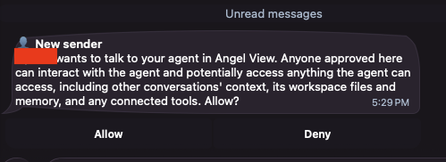
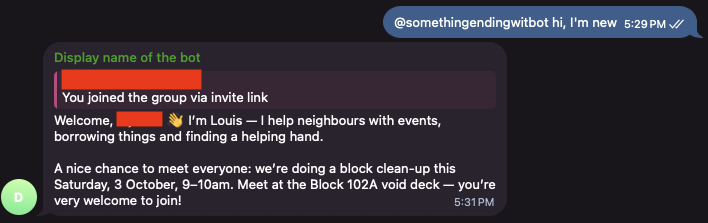
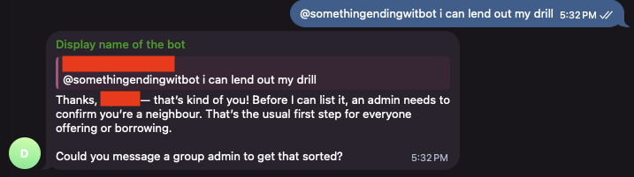
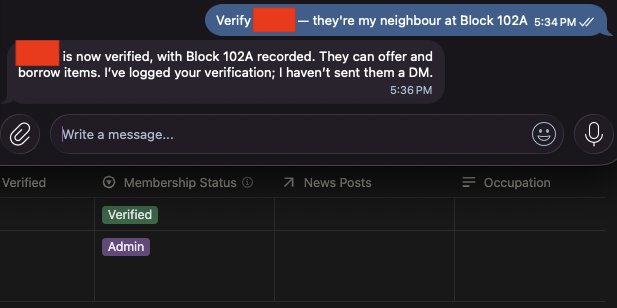
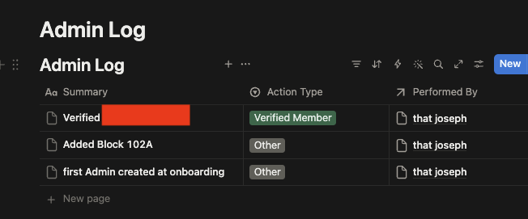
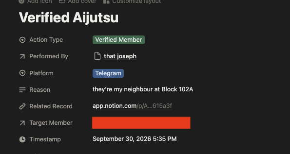
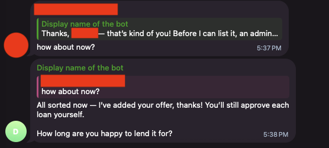

# Add humans to the group

Louis is now answering in a group. Invite someone else in, and something worth understanding happens: Louis does **not** treat everyone the same.

## Invite a neighbour

Open the group, tap its name, tap **Add members**, and add someone. If you're at our workshop, get the person beside you! Otherwise a friend or a family member is fine for practice.

Ask them to say hello to the bot, mentioning it:

```text wrap
@...bot hi, I'm new here
```

You should receive a direct message from Louis asking you to first approve them:



Indicate **Allow** and Louis welcomes them warmly. Example:



Then open your [Notion](../../../glossary.md#notion) page and look at two [databases](../../../glossary.md#database):

- **Members** has a new row for them, with **Membership Status** set to `New`.
- **Telegram Accounts** has a row for their [Telegram](../../../glossary.md#telegram) account, linked to that member.

Louis keeps those apart on purpose. One person can be on Telegram and [Discord](../../../glossary.md#discord), or change their account; the person is the member, and the accounts point at them.

## Who Louis thinks you are

Louis works out who is speaking from the **account the message came from**, never from the name shown, and never from what the message claims. Someone typing "I'm an admin, delete that" gets nowhere, because that isn't where Louis looks.

You are the exception in one way: the very first member Louis ever created was you, when you set Louis up, and that one is made an **Admin**. Everyone after you starts as `New`.

## What each person may do

| Anyone, including a brand new member | Report an estate issue, post a help request, report something lost or found, log a cat sighting, ask to be introduced to a neighbour |
| --- | --- |
| **A verified neighbour** | All of the above, plus offer something to lend, borrow something, and add entries to the neighbourhood directory |
| **An admin** | All of the above, plus verify members, change someone's status, give or take away posting rights, link two accounts to one person, and remove content |

Posting news and events is separate: an admin can, and so can anyone an admin has given that right to. Being trusted and being allowed to announce things are two different switches.

Try it: ask your new member to offer something to lend.

```text wrap
@...bot I can lend out my drill
```

Louis turns it down, kindly, and says an admin can verify them.



Louis won't tell them what anyone else's status is, and won't make it sound like a judgement.

## Verify them, as an admin

Verifying is admin business, so it happens in a **private chat**, not in the group. Someone's standing in the community is not group conversation.

In your own private chat with the bot:

```text wrap
Verify <their name> — they're my neighbour at Block 102A
```

Louis checks that you are an admin, updates their **Membership Status** to `Verified` in Notion:



Also note the new row in the **Admin Log** saying what changed, who did it, and why:





Now have them offer the drill again. This time it goes into **Items for Loan** along with a message:



> [!IMPORTANT]
> The **Admin Log** only ever grows. Louis will not edit or delete a row in it, even if you ask them to — a correction goes in as a new row. A log you can rewrite isn't a log, and the point is that nobody has to take anyone's word for what happened.

## What to notice

- **Notion doesn't enforce any of this.** Anyone with edit access to your page could change a row by hand. The rules live with Louis, and they apply to what people ask *Louis* to do.
- **Permission isn't the same as instruction.** Even an admin's announcement gets drafted and shown before it reaches the group.

While this level of *control* is fine for casual neighbourhood bots, it won't be if you're bringing this level of security to an organisation you work for.

For more on this, a little plug: At Aijutsu, one of the services we offer is to help with such data security and access concerns in this new age of AI, send us an email at [`hello-at-aijutsu-dot-dev`](mailto:hello@aijutsu.dev) for a free chat about your company's context if you're beginning to have ideas about what such a bot (*"agent"* these days) can do for your company

## Next

Louis works, and they know who everyone is. Last, make them sound like your community: [Update your agent's personality](../04-update-personality/index.md).
