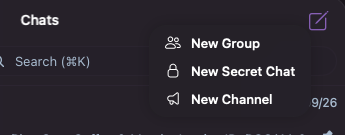
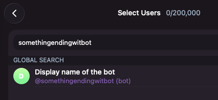
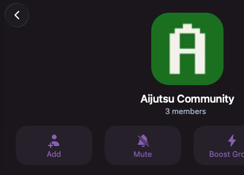
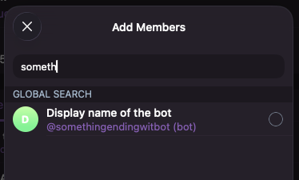
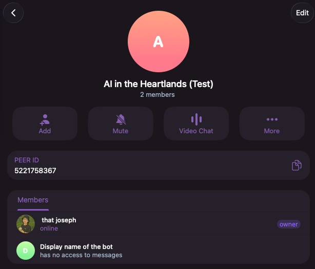

# Create a Telegram group

Louis is built for people, so let's make the group he will live in.

Don't use a real one yet even if you have one — your block's chat, your neighbours, your family. Trust us you might find yourself without a block, neighbours, or family.

Form a group of two or three AI-friendly people first so we can learn more without invoking panic. Your coursemates would be good for this, probably.

## Make the group

1. Open Telegram. Tap the pencil (**New Message**), then **New Group**.

   

2. Give it a name, for example `Angel Residences`.
3. Telegram asks who to add. Search for your bot by its username (it's the one that ends in `___bot`) and pick it.

   

   If Telegram won't let you add it while making the group, create the group first with only yourself, then open the group.

   

   Tap the group name, tap **Add**, and add the bot there.

   

   Select the bot and use the **OK** button to add the bot.

## Let it see the messages

If you skipped turning off Group Privacy back in [Create your Telegram bot](../../02-setting-up-nanoclaw/01-telegram-bot/index.md), do it now otherwise your bot will not respond to any message.

## Check that it worked

Tap the group's name to see its members. Your bot is in the list.

Under the bot's name it may say **has no access to messages**. That is Telegram telling you Group Privacy is still on, and it is the one thing that will stop your agent answering. Turn it off as described above, then remove the bot from the group and add it again.

It is quiet, and it should be. The bot is in the room, but nobody has told Louis to answer for it yet. That is the next page.

## Next

Now connect your agent to the group: [Add your agent to the group](../02-add-agent-to-group/index.md).
