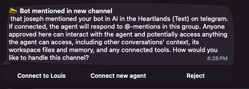
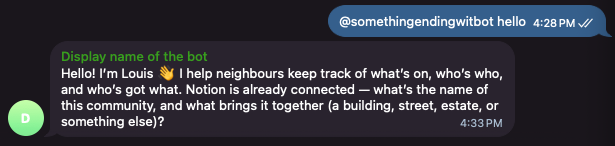

# Add your agent to the group

Putting the bot in the group was only half of it. In NanoClaw, the **bot** is the phone line and the **agent** is who picks it up. Your group has a line but nobody on it, so a message there gets no answer.

Connecting them takes one message and one tap.

## Wake it up

In the group, mention the bot by its username and say anything:

```
@...bot hello
```

Use your own bot's username. The mention matters: NanoClaw ignores ordinary chatter in a room it hasn't been introduced to, so a plain "hello" does nothing.

Nothing happens in the group. That is expected.

## Say yes in your private chat

Open your **private** chat with the bot — the one you have been using all along. NanoClaw would have sent you a card that looks like:



It tells you which group it was (`AI in the Heartlands (Test)` in the example image), and who mentioned it (`that joseph` in the example image). Under that are your choices:

| Choice | What it does |
| --- | --- |
| **Connect to Louis** | Puts Louis on that group. **This is the one you want to choose.** |
| **Connect new agent** | Makes a **brand new, empty** agent for the group. For the purposes of this course, do not choose this otherwise it won't be Louis and your agent won't know about it's community management repsonsibilities or your Notion page. |
| **Reject** | Ignores that group from now on. Maybe don't click this either |

Tap **Connect to Louis**.

> [!NOTE]
> If you have more than one agent, the card says **Choose existing agent** instead, and asks which. If you only have Louis, you get his name on the button.

You should now see a message:

```
✅ Connected to Louis by <your username>
```

Louis now knows to answer in that group. He replies when someone mentions him, or replies to one of his messages. The rest of the time, the group can talk normally without him joining in. His answers quote the message he is answering, so in a busy group you can see which question each answer is for. You should also see Louis introducing themselves:



## Give him something to do

Everything below happens in the group chat. Mention the bot to start. When Louis answers you, Telegram starts your reply to him by itself, so you can just type your next message to carry on the conversation. To reply to an older message of his, press and hold it (or right-click it on a computer), then choose **Reply**.

**Ask Louis something he has to look up:**

```
@...bot what's on this week?
```

He reads the **Events** database in your Notion page and answers from it. With nothing in there yet, he says so plainly rather than inventing an answer.

**Tell him something he has to write down:**

```
@...bot we're doing a block clean-up this Saturday from 9am to 10am by the playground
```

He writes it into **Events**. Open your Notion page and look: there is the row, with the date and the place.

**Then ask again:**

```
@...bot what's on this week?
```

This time he reads back what he wrote. Nothing was stored in the chat — the chat was just how you told him.

## What to notice

- **The chat is the interface, Notion is the memory.** You can close Telegram, open Notion, and read everything he knows. You can also fix a row by hand, and he reads your correction next time.
- **He confirms before he posts.** Ask him to announce something to the group and he drafts it and shows it to you first.
- **He can't do what he hasn't been wired to.** He only sees groups he has been added to. If your community talks in three chats and he is in one, he knows about one.

## Next

Louis is working. Now bring in the people he is working for: [Add humans to the group](../03-add-humans-to-group/index.md).
