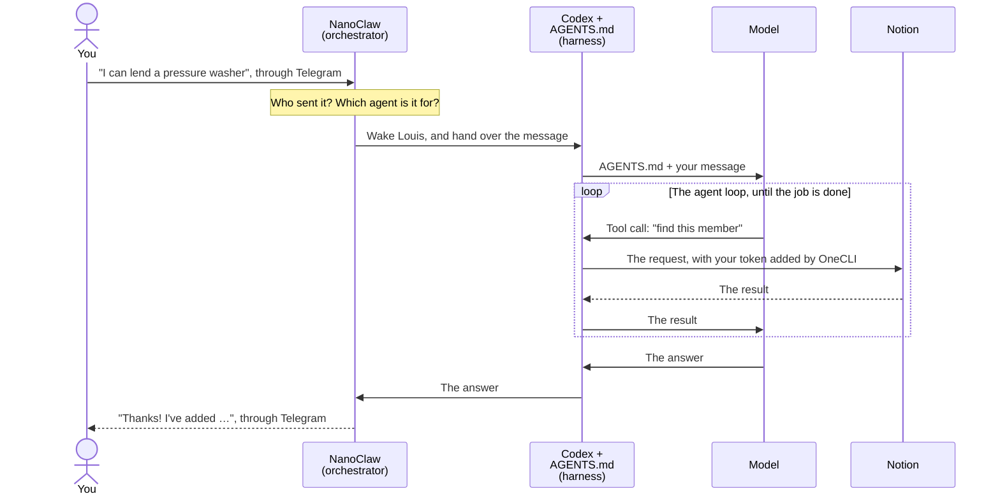

# How it fits together

Louis operated as such: you wrote, they answered, and things happened in [Notion](../../../glossary.md#notion). Underneath this, a few separate systems and processes were happening. This page explains them and they also explain almost every AI agent you will meet, not only this one.

## The four concepts

**The [model](../../../glossary.md#model) is the brain.** It is the part that reads and writes. For Louis, it is OpenAI's model, reached through your [ChatGPT](../../../glossary.md#chatgpt) plan. A model can only do one thing: read text and write text back. It can't open Notion, send a [Telegram](../../../glossary.md#telegram) message, or look at a clock. It doesn't even remember you between conversations.

**The [harness](../../../glossary.md#harness) is the body around the brain.** It is everything that turns a model into something that can act, and it has two halves. Louis's harness is:

- **[Codex](../../../glossary.md#codex)**, a program that runs inside Louis's [Docker](../../../glossary.md#docker) container. It hands the model text to read, carries out what the model asks for, and keeps going until the job is done.
- **`AGENTS.md`**, the instruction file Codex hands to the model every time. It says who Louis is, what the rules are, and which tools exist and how to use them.

Neither half is a harness on its own. Codex without the file is a general helper with no idea that it is Louis. The file without Codex is a page of text that nobody acts on. On [Claude](../../../glossary.md#claude), the two halves would be [Claude Code](../../../glossary.md#claude-code) and a file called `CLAUDE.md` instead.

**A [tool call](../../../glossary.md#tool-call) is how the brain asks the body to act.** When the model needs something done, it writes a request in a fixed format, like "add a row to Items for Loan: pressure washer". The harness does the real work, then shows the model the result. The model only ever writes. The harness acts.

**Data is what the model doesn't know by itself.** A model learned from a huge amount of text, but nothing about your block, your neighbours or this Saturday's clean-up.

We used Notion for this lesson, but the underlying concept of that is what's known as a *persistent [data source](../../../glossary.md#data-source)*, and it reaches the model in two ways:

- **Instructions**, read every time Louis wakes up: their persona, their ground rules, and their personality notes.
- **[Data sources](../../../glossary.md#data-source)**, read and written through tool calls to your Notion page.

More advanced systems that can respond more quickly rely on vector data stores for this. It's beyond the scope of this course which focuses on practicality but if you'd like to dig deeper, the term is [RAG](../../../glossary.md#rag).

## And who runs it all: the orchestrator

A model and a harness make one agent that can do one job when asked. Someone still has to bring it the work. That is **[NanoClaw](../../../glossary.md#nanoclaw)**, and its job has a name: it is an [orchestrator](../../../glossary.md#orchestrator). It doesn't think, and it doesn't make tool calls. It runs everything around the harness:

- it collects messages from Telegram, and decides which agent each one is for;
- it checks whether the sender is allowed in;
- it starts Louis's Docker container, and Codex inside it, when there is work, and lets them go back to sleep after;
- it builds the instruction half of Louis's harness: it writes `AGENTS.md`, and decides which tools Codex gets, like Notion and a tool for posting messages;
- it keeps Louis's schedules, and wakes them up when one is due;
- it delivers Louis's answers back to Telegram.

Think of a restaurant. The model is the chef's skill, the harness is the kitchen — the equipment (Codex) and the recipe book (`AGENTS.md`) — and NanoClaw is the front of house: it takes the orders, seats the guests, and serves the food. One NanoClaw can run many agents, each with its own kitchen.

## One message, start to finish

Here is roughly what happened when you told Louis, in [Put something in it](../../03-setting-up-data-sources/04-watch-it-fill/index.md), that you can lend a pressure washer. The model decides its own tool calls, so the exact ones change from run to run.

Step by step:

1. **You write.** Your message goes to Telegram's servers, not straight to your computer.
2. **NanoClaw collects it.** It checks with Telegram for new messages, using your bot's [token](../../../glossary.md#token). Then it works out who sent the message and which agent it is for. A stranger in a group is held until you approve them. That is the card you answered in [Add humans to the group](../../04-agent-customisations/03-add-humans-to-group/index.md).
3. **NanoClaw wakes Louis.** If their container isn't running, it starts one, with Codex inside. Before it does, it writes `AGENTS.md` fresh, from their persona, their personality notes and NanoClaw's own rules. That is the instruction half of the harness, rebuilt every time.
4. **The harness goes to work.** Codex hands the model `AGENTS.md` and your message.
5. **The model makes tool calls.** It can't touch Notion, so it asks: find this member, add this block, add these items. Codex makes each request, and the model reads each result before it decides on the next step. This back-and-forth is called the **agent loop**, and it is the difference between an agent and a chatbot. A chatbot answers once. An agent keeps going until the job is done.
6. **The token stays outside.** Every request to Notion passes through [OneCLI](../../../glossary.md#onecli), which adds your Notion token on the way out. Louis never sees the token, so they can't leak it, even if someone tricks them.
7. **The model writes the answer.** Codex hands it back, and NanoClaw delivers it to Telegram. In a group, the answer quotes the message it replies to.

## The same parts, in everything you did

Every customisation in the course was the same parts, used differently:

| What you did | The tool call the model made | Where the data went |
| --- | --- | --- |
| Told Louis about yourself | Read and wrote rows in Notion | Your Notion page |
| Asked Louis to talk like Phua Chu Kang | Rewrote a file in their workspace | `personality.md`, read every time they wake up |
| Verified a neighbour | Changed their row, and added an Admin Log row | Your Notion page |
| Asked for a hello every 5 minutes | Ran NanoClaw's `ncl tasks create` command | NanoClaw's list of scheduled tasks |
| Received the scheduled hello | A message tool, to post into Angel View | Telegram |

The last row is the odd one out. Nobody wrote to Louis. **NanoClaw woke Louis on its own**, because the clock said so. Neither the model nor the harness is in charge of time. The orchestrator is.

## Why it is built this way

- **The model can't be trusted with keys, so it never holds them.** OneCLI keeps the tokens and adds them on the way out. Docker keeps Louis in a box, so they can only see the files you gave them, not the rest of your computer.
- **The model forgets, so NanoClaw remembers.** Instructions, personality and schedules are all written down outside the model, and handed back to it each time it wakes.
- **The brain and the body can be swapped.** NanoClaw can run an agent on Claude instead of Codex, which changes both the model and the harness: Claude Code with a `CLAUDE.md`, instead of Codex with an `AGENTS.md`. Telegram, Notion, the schedules and the rules would all stay the same, because they belong to the orchestrator, NanoClaw.

## Next

See where all of that lives on your computer: [Inside NanoClaw](../03-nanoclaw-internals/index.md).
