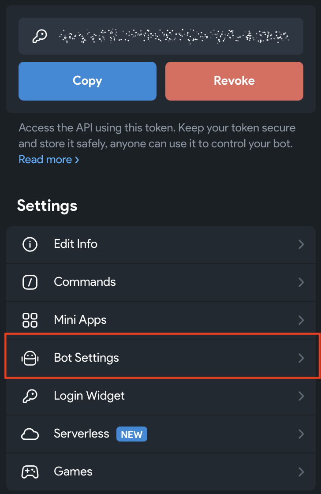

# Building community agents with NanoClaw

# Course overview

This course introduces:

1. What a basic development setup looks like.
2. The basic parts of an agent [harness](../glossary.md#harness): the model, the tools, and the data.
3. A basic integration that uses Notion to store data.

By the end of this course, you should:

1. Be able to describe software you'd install in order to start working on building a community agent
2. Understand how Codex and ChatGPT are related to each other
3. Be familiar with Nanoclaw installation using Codex by OpenAI for the model, and Telegram as the chat interface
4. Know how to use Codex to setup an agent in Nanoclaw based on a personality template
5. Know how to create a Notion integration and assign a Notion page as an agent's knowledge base

## Important notes

1. This course uses our own copy of NanoClaw. It is a [fork](../glossary.md#fork): a copy of a project that you can change without changing the original. We changed it with NanoClaw's own skills, so that it works with Telegram and Codex. Our version of Nanoclaw can be found at the [aith-nanoclaw-codex-telegram](https://github.com/aijutsu/aith-nanoclaw-codex-telegram) project on GitHub and can be used independently of this course

# Section 1: Installations

In this section, you get your computer ready and install NanoClaw. At the end, you have your own AI agent, and you can chat with it on Telegram.

## Pre-requisites

1. A free Telegram account. If you don't have one, sign up at <https://telegram.org/>.
1. A free Notion account. If you don't have one, sign up at <https://www.notion.so/>.
1. Administrator access to your computer.
1. At least a ChatGPT Plus subscription (~$30/month version).
1. Optional: a Claude Pro plan or higher, if you want to use Claude Code as your helper in [Step 7](#step-7-set-up-nanoclaw).
1. A computer that can run Docker, with at least 8 GB of memory:
   - **Mac:** macOS 14 (Sonoma) or newer.
   - **Windows:** Windows 11, or Windows 10 version 22H2. Microsoft stopped supporting Windows 10 in October 2025, so Windows 11 is best.
   - **Linux:** Ubuntu 22.04, 24.04 or 26.04.
1. Git and Docker. You install them in [Step 2](#step-2-install-git) and [Step 3](#step-3-install-docker) below.

## Installation steps

Some steps are different on macOS, Windows and Linux. Those steps have one section for each. Click the name of your computer's system to open its section.

### Step 1: Open a terminal

A [terminal](../glossary.md#terminal) is a window where you type commands for your computer. You use it for most of this course.

<details name="terminal">
<summary>macOS</summary>

1. Press Command (⌘) and Space together. This opens Spotlight search.
2. Type `Terminal` and press Return.

A window opens. This is where you type commands.

</details>

<details name="terminal">
<summary>Windows</summary>

NanoClaw can't run on Windows by itself. It runs inside [WSL](../glossary.md#wsl), a part of Windows that runs Linux. You install WSL once. After that, you type every command in this course into its Ubuntu terminal.

1. Click Start and type `PowerShell`. Right-click **Windows PowerShell** and choose **Run as administrator**. Click **Yes**.
2. Type this command and press Enter:

   ```powershell
   wsl --install
   ```

   Windows downloads WSL and [Ubuntu](../glossary.md#ubuntu). This takes a few minutes.

   If the command only shows a help text, WSL is already on your computer. Run `wsl --install -d Ubuntu` instead.
3. Restart your computer.
4. Click Start, type `Ubuntu`, and open it.
5. Ubuntu asks you to make a username and a password. They don't need to match your Windows ones. While you type the password, nothing shows on the screen. That is normal. Remember this password: Ubuntu asks for it when you install things.
6. Update Ubuntu with this command:

   ```bash
   sudo apt update && sudo apt upgrade -y
   ```

   `sudo` means "run this as an administrator", so Ubuntu asks for the password you just made.

From now on, "open a terminal" means: click Start, type `Ubuntu`, and open it. Type the commands in this course there, not in PowerShell.

</details>

<details name="terminal">
<summary>Linux</summary>

Press Ctrl, Alt and T together. A terminal window opens.

If nothing happens, open your list of apps and search for `Terminal`.

</details>

### Step 2: Install Git

[Git](../glossary.md#git) keeps the history of a project's files. You use it to download NanoClaw in Step 6.

The same command also installs jq, a small tool that NanoClaw's setup uses to check your Telegram bot.

<details name="git">
<summary>macOS</summary>

On a Mac, you install Git with [Homebrew](../glossary.md#homebrew). NanoClaw's setup uses Homebrew too.

1. Copy this command into the terminal and press Return:

   ```bash
   /bin/bash -c "$(curl -fsSL https://raw.githubusercontent.com/Homebrew/install/HEAD/install.sh)"
   ```

2. Type your Mac password when it asks, and press Return. Nothing shows while you type. That is normal.
3. Press Return again to start. Homebrew also installs Apple's Command Line Tools. This can take 5 to 10 minutes.
4. At the end, Homebrew may show **Next steps** with a few commands. Copy those commands into the terminal and press Return.
5. Install Git and jq:

   ```bash
   brew install git jq
   ```

</details>

<details name="git">
<summary>Windows</summary>

Git goes inside Ubuntu, not on Windows itself. You don't need "Git for Windows".

In the Ubuntu terminal, run:

```bash
sudo apt update && sudo apt install -y git curl jq
```

Type your Ubuntu password if it asks. Ubuntu usually has Git already. The command then just makes sure it's up to date.

</details>

<details name="git">
<summary>Linux</summary>

On Ubuntu or Debian, run:

```bash
sudo apt update && sudo apt install -y git curl jq
```

On Fedora, run:

```bash
sudo dnf install -y git curl jq
```

Type your password if it asks.

</details>

To check that Git works, run:

```bash
git --version
```

You should see a line like `git version 2.55.0`. Your number may be different.

### Step 3: Install Docker

NanoClaw runs your agent inside [Docker](../glossary.md#docker). Docker puts the agent in a closed box, called a container, so the agent can't touch the rest of your computer.

<details name="docker">
<summary>macOS</summary>

On a Mac, you can use OrbStack or Docker Desktop. Both give you the `docker` command that NanoClaw needs. You only need one of them.

**Recommended: OrbStack.** [OrbStack](../glossary.md#orbstack) is smaller and lighter than Docker Desktop, so your Mac stays fast. It is free for personal use. If you use it for work, your company needs a paid licence.

1. Install OrbStack with Homebrew:

   ```bash
   brew install orbstack
   ```

2. Open **OrbStack** from your Applications folder.
3. If OrbStack asks what you want to use it for, choose **Docker**. If it asks for your Mac password, type it. OrbStack needs it to set up the `docker` command.

NanoClaw needs OrbStack to be running. Open OrbStack before you use NanoClaw.

**Or: Docker Desktop.** Docker Desktop is free for personal use, education, and small businesses.

1. Install Docker Desktop with Homebrew:

   ```bash
   brew install --cask docker-desktop
   ```

   Type your Mac password if it asks.
2. Open **Docker** from your Applications folder.
3. Read the Docker Subscription Service Agreement and click **Accept**.
4. Choose **Use recommended settings** and click **Finish**. Type your Mac password if it asks.
5. You don't need a Docker account. If Docker asks you to sign in, you can skip it.
6. Wait until Docker Desktop says that Docker is running. A whale icon appears in the menu bar at the top of the screen.

NanoClaw needs Docker Desktop to be running. To start it every time you turn on your Mac, open Docker Desktop's **Settings**, then **General**, and turn on **Start Docker Desktop when you sign in to your computer**.

</details>

<details name="docker">
<summary>Windows</summary>

On Windows, you install Docker Desktop on Windows itself. It then gives Ubuntu a `docker` command. Don't install Docker inside Ubuntu.

1. Go to <https://docs.docker.com/desktop/setup/install/windows-install/> and download Docker Desktop for Windows. Most computers need the x86_64 version.
2. Open the file you downloaded, `Docker Desktop Installer.exe`.
3. Keep **Use WSL 2 instead of Hyper-V** ticked. Follow the steps, then click **Close**.
4. Click Start, type `Docker Desktop`, and open it. Read the Docker Subscription Service Agreement and click **Accept**. Docker Desktop is free for personal use, education, and small businesses.
5. You don't need a Docker account. If Docker asks you to sign in, you can skip it.
6. In Docker Desktop, open **Settings** (the gear icon), then **Resources**, then **WSL integration**. Turn on **Ubuntu** and click **Apply**.
7. Close the Ubuntu terminal and open it again, so that it finds Docker.

NanoClaw needs Docker Desktop to be running. To start it every time you turn on your computer, open Docker Desktop's **Settings**, then **General**, and turn on **Start Docker Desktop when you sign in to your computer**.

</details>

<details name="docker">
<summary>Linux</summary>

1. Download and run Docker's install script:

   ```bash
   curl -fsSL https://get.docker.com -o get-docker.sh
   sudo sh get-docker.sh
   ```

   This installs Docker Engine and starts it. It takes a few minutes.
2. Let your user run Docker without typing `sudo` every time:

   ```bash
   sudo usermod -aG docker $USER
   ```

   This gives your user full control of Docker, like an administrator. Only do this on your own computer.
3. Log out of your computer and log in again, so that the change takes effect. Then open a new terminal.

</details>

To check that Docker works, run:

```bash
docker run hello-world
```

Docker downloads a tiny test program and runs it. You should see `Hello from Docker!`.

If you see `Cannot connect to the Docker daemon`, Docker isn't running. On a Mac, open OrbStack or Docker Desktop. On Windows, open Docker Desktop and wait until it's running. On Linux, log out and log in again.

### Step 4: Install Codex

[Codex](../glossary.md#codex) is OpenAI's AI helper. NanoClaw's setup needs it to connect your agent to your ChatGPT account. You also use Codex later in this course, to change your agent.

The command is the same on macOS, Windows (in Ubuntu) and Linux:

```bash
curl -fsSL https://chatgpt.com/codex/install.sh | sh
```

At the end, it says `Codex CLI … installed successfully`. Close the terminal and open a new one, so that it finds Codex.

Then start Codex and sign in:

```bash
codex
```

1. Choose **Sign in with ChatGPT**. Your browser opens.
2. Sign in to your ChatGPT account, then go back to the terminal. If no browser opens, copy the link that Codex shows into your browser.
3. Type `/quit` and press Enter to leave Codex.

### Step 5: Create your Telegram bot

A bot is an automatic Telegram account. Your agent uses it to chat with you. You make bots with BotFather, Telegram's official bot for making bots.

1. In Telegram, search for `@BotFather` and open it. Check that it has a blue tick. Tap **Start**.
2. Send `/newbot`.
3. BotFather asks for a name. This is the name people see, for example `Heartlands Helper`.
4. BotFather asks for a username. It must end in `bot`, for example `heartlands_helper_bot`. It can only use letters, numbers and underscores (`_`). You can't change it later.
5. BotFather replies with a token, like `123456789:AAHdqTcvCH1vGWJxfSeofSAs0K5PALDsaw`. The token is your bot's password: anyone who has it can control your bot. Don't share it. You need it in Step 7.

To use your bot in group chats, turn off its Group Privacy setting. With Group Privacy on, the bot only sees messages that mention it.

1. After the bot is created, open its page in BotFather and scroll down to **Bot Settings**.

   

2. Tap **Bot Settings** and turn off **Group Privacy**.

   

You can also do this in the chat with BotFather: send `/mybots`, pick your bot, then tap **Bot Settings**, **Group Privacy**, and **Turn off**.

If your bot is already in a group, remove it from the group and add it again. The change only works after that.

### Step 6: Download NanoClaw

Run these three commands:

```bash
cd ~
git clone https://github.com/aijutsu/aith-nanoclaw-codex-telegram.git nanoclaw
cd nanoclaw
```

- `cd ~` goes to your home folder. On Windows, this keeps NanoClaw inside Ubuntu, where it runs faster than on your C: drive.
- `git clone` downloads our copy of NanoClaw into a new folder called `nanoclaw`. You see `Cloning into 'nanoclaw'...`.
- `cd nanoclaw` moves you into that folder.

Don't move or rename the `nanoclaw` folder after setup. NanoClaw names its background service after the folder, and moving it breaks the link.

### Step 7: Set up NanoClaw

Your agent runs on Codex. For setup itself, you can use Codex or [Claude Code](../glossary.md#claude-code) as your helper. The helper shows you NanoClaw's setup skill, and helps you fix things if setup stops with an error. Open the one you use.

NanoClaw comes with [skills](../glossary.md#skills): instructions that Codex and Claude Code can read. First, see one of them in action.

<details name="setup-helper">
<summary>Codex</summary>

You installed Codex in Step 4.

1. In the `nanoclaw` folder, start Codex:

   ```bash
   codex
   ```

   If Codex asks whether you trust this folder, say yes.
2. Type `$setup` and press Enter. Codex reads NanoClaw's setup skill. It tells you to run `bash nanoclaw.sh`.
3. Type `/quit` and press Enter to leave Codex. Setup asks you questions as it runs, so you run it yourself, in the terminal.

If setup stops with an error:

- **After setup has connected Codex,** it asks **Want to debug this with Codex?** Choose **Yes**. Codex opens. It already knows what went wrong, and helps you fix it. Type `/quit` to go back to setup.
- **Before that,** it asks **Claude CLI is needed to diagnose this. Install it now?** Claude needs a Claude plan. If you don't have one, choose **No**. Then start Codex in the `nanoclaw` folder and ask it: "Setup failed. Read logs/setup.log and help me fix it."

</details>

<details name="setup-helper">
<summary>Claude Code</summary>

Claude Code needs a Claude plan: Pro or higher. The free plan doesn't include it. Your agent still runs on Codex, so you also need Codex (Step 4) and your ChatGPT plan.

1. Install Claude Code:

   ```bash
   curl -fsSL https://claude.ai/install.sh | bash
   ```

2. Check that it works:

   ```bash
   claude --version
   ```

   You should see a version number, like `2.1.211 (Claude Code)`. If you see `command not found`, close the terminal, open a new one, and try again.
3. In the `nanoclaw` folder, start Claude Code:

   ```bash
   cd ~/nanoclaw
   claude
   ```

   The first time, your browser opens. Sign in to your Claude account, then go back to the terminal. If Claude Code asks whether you trust this folder, say yes.
4. Type `/setup` and press Enter. Claude Code reads NanoClaw's setup skill. It tells you to run `bash nanoclaw.sh`.
5. Type `/exit` and press Enter to leave Claude Code. Setup asks you questions as it runs, so you run it yourself, in the terminal.

If setup stops with an error:

- **Before setup has connected Codex,** it asks **Want to debug this with Claude?** Choose **Yes**. Claude Code opens. It already knows what went wrong, and helps you fix it. Type `/exit` to go back to setup.
- **After that,** it offers Codex first: **Want to debug this with Codex?** Choose **Yes** to use Codex, and type `/quit` to go back to setup.

</details>

Before you run setup:

- **On a Mac:** make sure OrbStack or Docker Desktop is running.
- **On Windows:** make sure Docker Desktop is running.
- **On Windows or Linux:** run `sudo -v` and type your password. Setup installs some programs, and this lets it do that without stopping to ask.

Now run setup:

```bash
bash nanoclaw.sh --agent-provider codex
```

`--agent-provider codex` tells setup to run your agent on Codex. Without it, setup uses Claude.

Setup installs the rest of what NanoClaw needs, and builds your agent's container. The first build usually takes 3 to 10 minutes. Use the arrow keys to pick an answer, then press Enter. Answer the questions like this:

| Setup asks | Your answer |
| --- | --- |
| How would you like to begin? | **Standard setup** |
| How should we create your first agent? | **Fresh agent** |
| How would you like to connect Codex? | **Sign in with my ChatGPT subscription**. Sign in in the browser, then go back to the terminal. On Windows, if no browser opens, copy the link into your browser. |
| What should your assistant call you? | Your name |
| What next? | **Continue with setup** |
| I detected … from your computer settings. Is that right? | **Yes**, if it shows your time zone |
| Want to chat with your assistant from your phone? | **Yes, connect Telegram** |
| Connect Telegram? | **Yes, connect Telegram** |
| What should your assistant be called? | A name for your agent. The default is `Nano`. |
| How should this telegram account be registered? | **Owner** |
| Paste the bot token from BotFather | The token from Step 5. It stays hidden while you paste. That is normal. |
| Your pairing code is ready | Open your bot in Telegram and send it the 6 digits, as a private message. |

If setup asks something that isn't in this table, such as an offer of a free NanoClaw account, you can skip it.

When setup is done, it says **You're set.**

If setup stops with an error, it offers your helper, as described above. You can also run `bash nanoclaw.sh --agent-provider codex` again: it continues from where it stopped. Setup keeps a record of every step in `logs/setup.log`.

### Step 8: Say hi to your agent

Open Telegram. Your agent has sent you a message in your chat with your bot. Reply to it.

- In your private chat with the bot, your agent answers every message.
- In a group, mention the bot by its username, for example `@heartlands_helper_bot`, so that your agent answers.

NanoClaw runs in the background. Your agent only answers while your computer is on and Docker is running.

# References

| Title | Description | URL |
| --- | --- | --- |
| NanoClaw GitHub | GitHub repository for NanoClaw | <https://github.com/nanocoai/nanoclaw> |
| NanoClaw for this course | Our fork of NanoClaw, changed to work with Telegram and Codex | <https://github.com/aijutsu/aith-nanoclaw-codex-telegram> |
| NanoClaw Website | Website for NanoClaw | <https://nanoclaw.dev/> |
| Install WSL | Microsoft's guide to installing WSL on Windows | <https://learn.microsoft.com/en-us/windows/wsl/install> |
| Install Git | Git's download page, with steps for every system | <https://git-scm.com/install/> |
| Homebrew | The app store for the terminal on a Mac | <https://brew.sh/> |
| OrbStack | A lighter way to run Docker on a Mac | <https://docs.orbstack.dev/> |
| Docker Desktop | Docker's guide to installing Docker Desktop | <https://docs.docker.com/desktop/> |
| Docker Engine on Ubuntu | Docker's guide to installing Docker on Ubuntu | <https://docs.docker.com/engine/install/ubuntu/> |
| Codex CLI | OpenAI's guide to installing and using Codex in the terminal | <https://learn.chatgpt.com/docs/codex/cli> |
| Claude Code | Anthropic's guide to installing Claude Code | <https://code.claude.com/docs/en/setup> |
| Telegram bots | Telegram's guide to bots and BotFather | <https://core.telegram.org/bots/features#botfather> |
